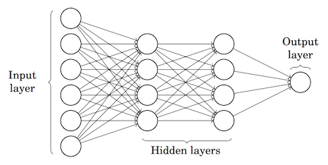

# Wacker#29

---

  <small>
  Wacker #26　2018/07/16(月)  
  </small>

 

### Google Colaboratoryで覚える初めての（？）機械学習（Deep Learning）

  

 

 Yohei Taniguchi 

  <small>

    [Wacker](http://wacker.io/)

  </small>

  

---

## AIと機械学習とDeep Learning 

---

### 強いAIと弱いAI

- 強いAI = 人間の知能そのものをもつ機械を作ろうとする立場
- 弱いAI = 人間が知能を使ってすることを機械にさせようとする立場

---

### 研究分野

参照：人工知能学会 What's AIより

---

### 機械学習の技術マップと・Deep Learning立ち位置

機械学習によって、人が行う学習と推論によって、分類と推測を行う

1. 教師なし
2. 教師あり
3. 強化学習

---

### 教師なし 

未知のデータや新たなデータ構造の発見を行う

- K平均法

---

### 教師あり 

事前の学習データを元に分類、推測を行う手法

- 決定木、ランダムフォレスト
- パーセプトロン、ニューラルネットワーク

---

### 強化学習 

教師あり学習で行った結果に良い悪いの重み付けをして行う手法

- Q学習
- CPにゲームをさせるケースに使われる

---

### MLP（多層パーセプトロン）

---

### CNN（畳み込みニューラルネット）1/3 

---

### CNN（畳み込みニューラルネット）2/3 

---

### CNN（畳み込みニューラルネット）3/3 

---

### RNN（再帰型ニューラルネット）

文字入力の候補を予測して出す

---

## プログラミングにおける機械学習のフレームワーク 

---

#### 今回使うフレームワーク 

- [TensorFlow](https://www.tensorflow.org/?hl=ja):Google,Python
- [Keras](https://keras.io/ja/):Python

---

#### その他、主なフレームワーク 

- [CNTK](https://docs.microsoft.com/ja-jp/cognitive-toolkit/):MS,C++,Python
- [Chainer](https://chainer.org/):Preferred Networks,Python
- [Pytorch](https://pytorch.org/):FB + NVIDIA,Python,ChainerのForkでCaffe2とマージ

---

#### 主なデータセット 

- [Kaggle](https://www.kaggle.com/)
- [UCI](http://archive.ics.uci.edu/ml/index.php)
- [datamarket](https://datamarket.com/data/)
- スクレイピング

---

## チュートリアル 

### Cats vs. Dogs 

https://www.kaggle.com/c/skoltech-cats-vs-dogs/data

---

### MNIST 

- 60,000点の訓練データ(mnist.train)と10,000点のテストデータ(minist.test)

---

### Taitanic生存者予測 

- [Titanic: Machine Learning from Disaster](https://www.kaggle.com/c/titanic)

---

## 参考情報

- [Google Colaboratory](https://colab.research.google.com/)
- [Google Colaboratory Github](https://github.com/googlecolab)

- [いちばんやさしいディープラーニング入門](https://www.amazon.co.jp/%E3%81%84%E3%81%A1%E3%81%B0%E3%82%93%E3%82%84%E3%81%95%E3%81%97%E3%81%84-%E3%83%87%E3%82%A3%E3%83%BC%E3%83%97%E3%83%A9%E3%83%BC%E3%83%8B%E3%83%B3%E3%82%B0-%E5%85%A5%E9%96%80%E6%95%99%E5%AE%A4-%E8%B0%B7%E5%B2%A1-%E5%BA%83%E6%A8%B9/dp/4800711878)

- 人工知能学会 What's AI : [http://www.ai-gakkai.or.jp/whatsai/AIresearch.html](http://www.ai-gakkai.or.jp/whatsai/AIresearch.html)
- [kaggle](https://www.codexa.net/what-is-kaggle/)
