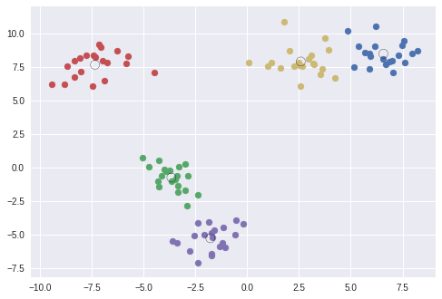

# Wacker#29

---

  <small>
  Wacker #26　2018/07/16(月)  
  </small>

 

### Wacker#29 Google Colaboratoryで覚える初めての（？）機械学習（Deep Learning）

  

 

 Yohei Taniguchi 

  <small>

    [Wacker](http://wacker.io/)

  </small>

  

---

## AIと機械学習とDeep Learning

参考：人工知能学会 What's AI : [http://www.ai-gakkai.or.jp/whatsai/AIresearch.html](http://www.ai-gakkai.or.jp/whatsai/AIresearch.html)

---

### 強いAIと弱いAI

- 強いAI = 人間の知能そのものをもつ機械を作ろうとする立場
- 弱いAI = 人間が知能を使ってすることを機械にさせようとする立場

---

### 研究分野

参照：人工知能学会 What's AIより

---

### 機械学習の技術マップと・Deep Learning立ち位置

機械学習によって、人が行う学習と推論によって、分類と推測を行う

1. 教師なし
1. 教師あり
1. 強化学習

---

### 教師なし

未知のデータや新たなデータ構造の発見を行う

- K平均法
- https://colab.research.google.com/drive/1yLfjHo0axYXLqfI4tEIqWK4_qu3z_lVU

---

### 教師あり

事前の学習データを元にテストデータの分類、推測を行う手法

- 線形回帰
- パーセプトロン
- 決定木
- ランダムフォレスト
- ニューラルネットワーク
- 畳込みニューラルネットワーク

---

### 強化学習

教師あり学習で行った結果に良い悪いの重み付けをして行う手法

- Q学習

---

### ニューラルネットワーク

- ニューロンとパーセプトロン
- 活性化関数
- 学習則（Learning Rulu)

---

### プログラミングにおける機械学習のフレームワーク

#### 今回使うフレームワーク

- [TensorFlow](https://www.tensorflow.org/?hl=ja):Google,Python
- [Keras](https://keras.io/ja/):Python

---

#### その他、主なフレームワーク

- [CNTK](https://docs.microsoft.com/ja-jp/cognitive-toolkit/):MS,C++,Python
- [Chainer](https://chainer.org/):Preferred Networks,Python
- [Pytorch](https://pytorch.org/):FB + NVIDIA,Python,ChainerのForkでCaffe2とマージ

---

#### 主なデータセット

- [Kaggle](https://www.kaggle.com/)
- [UCI](http://archive.ics.uci.edu/ml/index.php)
- [datamarket](https://datamarket.com/data/)
- スクレイピング

---

## チュートリアル：Cats vs. Dogs

### 説明

https://www.kaggle.com/c/skoltech-cats-vs-dogs/data

---

## チュートリアル：MNIST

### 説明
- 60,000点の訓練データ(mnist.train)と10,000点のテストデータ(minist.test)

---

## 参考情報

- DataSet

- https://ai-kenkyujo.com/2017/10/18/free-dataset/

- kaggle https://www.codexa.net/what-is-kaggle/

- その他

- IBM:AIを「Artificial Intelligence（人工知能）」ではなく、「Augmented Intelligence （拡張知能）」

https://www.slideshare.net/masa_s/gan-83975514

https://elix-tech.github.io/ja/2017/02/06/gan.html

